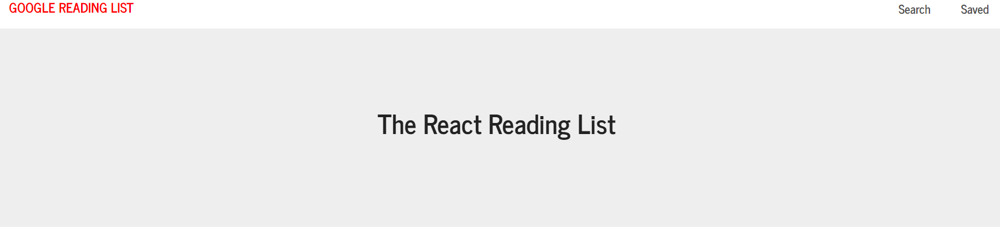
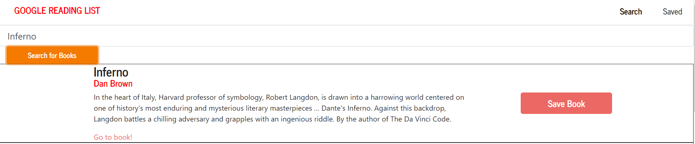
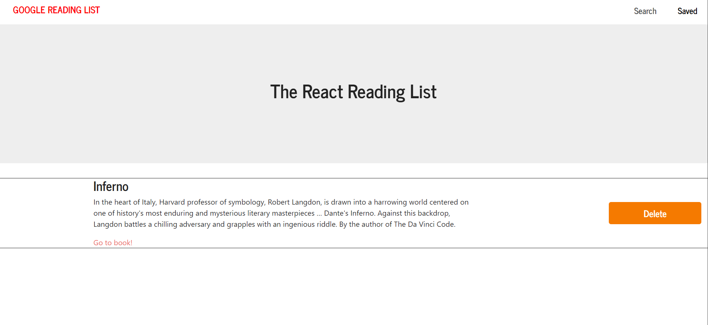

# GoogleBookSearch

## Overview

GoogleBookSearch creates readings lists out of an API created in this application. Using React router, this application is a single page application with dynamic components Users are able to manipulate books to add, save and delete them from a given list.

## Required npm packages

mongoose, axios, react-router-dom

## Technologies

- Bootstrap
- Express
- Node.js
- React
- MongoDB
- Heroku

<h1>Layout:</h1>
<ol>
<li><strong>React Component Page Setup</strong></li>
    <ul>
        <li>Operates quickly in a modular ecosystem</li>
    </ul>

<li><strong>Front End</strong></li>
   <ul>
      <li>Collects Users Inputs</li>
        <li>Searches Google's Book API</li>
        <li>Displays Retrived Data</li>
    </ul>

<li><strong>Back End</strong></li>
    <ul>
        <li>MongoDb</li>
            <ol>
            <li>Utilizes MongoDb database model</li>
            <li>Handles CRUD methods</li>
            <li>Updates with each time a book is added or deleted</li>
            </ol>
        <li>Express</li>
            <ol>
                <li>handles all of our http requests and responses</li>
                <li>backbone of our api and html routing</li>
            </ol>
    </ul>    
</ol>

<h1>Demo:</h1>
<ol>
<li>Homepage</li>
 

 
 

<li>Search For a Book</li>
 

 
 

<li>Click to Save Book</li>
 

 
 

<li>The saved book appears on the home page</li>
 

 
 

<li>You are able to delete a certain book once you have finished it</li>

</ol>

## Live Site

[Deployed](https://react-bookshelf2020.herokuapp.com/)
