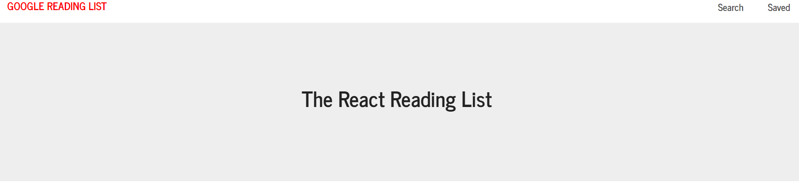
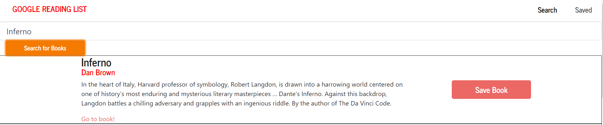
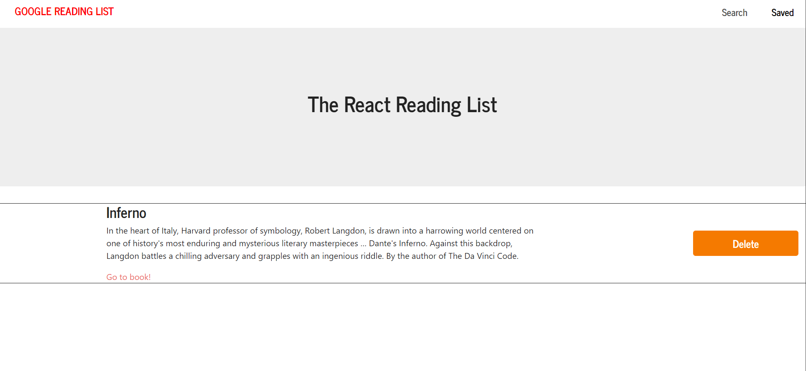

# GoogleBookSearch

## Overview
GoogleBookSearch creates readings lists out of an API created in this application. Using React router, this application is a single page application with dynamic components Users are able to manipulate books to add, save and delete them from a given list.

## Required npm packages
mongoose, axios, react-router-dom

## Technologies
* Bootstrap
* Express
* Node.js
* React
* MongoDB
* Heroku

<h1>Demo:</h1>
<ol>
<li>Homepage</li>

 

<li>Search For a Book</li>

 

<li>Click to Save Book</li>

 

<li>The saved book appears on the home page</li>

 
<li>You are able to delete a certain book once you have finished it</li>

</ol>

## Live Site
[Deployed](https://react-bookshelf2020.herokuapp.com/)